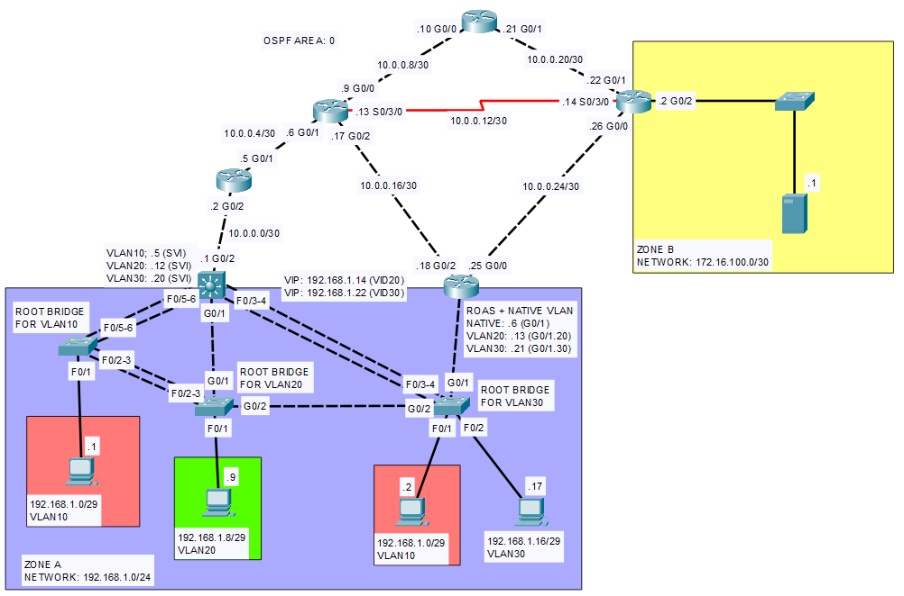

# Lab 01 - The Redundant Network

This lab includes essential networking concepts for the CCNA certification. It covers a range of topics including VLAN configuration, Hot Standby Router Protocol (HSRP) for gateway redundancy, Rapid Spanning Tree Protocol (RSTP) for Layer 2 loop prevention, Link Aggregation Groups (LAG) for increased bandwidth and redundancy, and OSPF for dynamic routing.
The network topology features multiple VLANs, redundant links, and point-to-point connections, simulating a real-world environment that requires both Layer 2 and Layer 3 networking knowledge. Through this lab, users will gain practical experience in configuring and troubleshooting these technologies, ensuring a solid understanding of how they interoperate to create a resilient and efficient network.

## Relevant CCNA Exam Topics

This lab convers the following requirements in the CCNA Exam Topics List:

- **Network Fundamentals**
    - Explain the role and function of network components
    - Configure and verify IPv4
- **Network Access**
    - Configure and verify VLANs
    - Configure and verify interswitch connectivity
    - Configure and verify EtherChannel (LACP)
    - Interpret basic operations of Rapid PVST+ Spanning Tree Protocol
- **IP Connectivity**
    - Configure and verify IPv4 static routing
    - Configure and verify single area OSPFv2
    - Describe the purpose, function, and concepts of first hop redundancy protocols (FHRP)

## Commands You Should Known

Here you have all the commands you will need to complete this lab.

### General Commands

| **Command** | **Config Mode** | **Description** |
|-------------------------------------------|-------------------------|---------------------------------------------------------------------------------------------------|
| **channel-group {ethc-num} mode {mode}** | Interface Configuration | Creates an EtherChannel interface for Link Aggregation. |
| **ip address {address} {netmask}** | Interface Configuration | Assigns an IP address and subnet mask to an interface. |
| **interface Loopback{number}** | Global Configuration | Creates a loopback interface. |

### Router-specific Commands

| **Command** | **Config Mode** | **Description** |
|----------------------------------------------------|-------------------------|---------------------------------------------------------------------------------------------------|
| **encapsulation ppp** | Interface Configuration | Configures the interface to use PPP (Point-to-Point Protocol) for encapsulation. Used in serial links. |
| **clock rate {speed}** | Interface Configuration | Sets the clock rate on a serial interface. |
| **interface {interface}.{subinterface}** | Global Configuration | Creates a subinterface on a physical interface for a specific VLAN. It is recommended to match the subinterface value with the VLAN ID. |
| **encapsulation dot1Q {vlan-id}** | Subinterface Configuration | Configures the subinterface to use 802.1Q encapsulation for inter-VLAN routing. |
| **standby {group number} ip {ip address}**| Interface Configuration | Configures HSRP (Hot Standby Router Protocol) by assigning a virtual IP address. |
| **standby {group number} priority {priority value}** | Interface Configuration | Sets the HSRP priority for determining the active router. |
| **standby {group number} preempt** | Interface Configuration | Allows the router to take over as the active router if it has a higher priority. |
| **ip route {destination network} {subnet mask} {next-hop address} [administrative distance]** | Global Configuration | Configures a static route to a specific destination network. |
| **router ospf {process-id}** | Global Configuration | Enters OSPF router configuration mode. |
| **ip ospf {process-id} area {area-id}** | Interface Configuration | Enables OSPF routing on the interface in a specific area. |
| **passive-interface {interface}** | OSPF Router Configuration | Configures a specific interface as a passive OSPF interface, preventing it from sending OSPF hello packets. |
| **auto-cost reference-bandwidth {bandwidth}** | OSPF Router Configuration | Adjusts the OSPF cost calculation to accommodate higher-speed interfaces. |

### Switch-specific Commands

| **Command** | **Config Mode** | **Description** |
|--------------------------------------------------|-------------------------|---------------------------------------------------------------------------------------------------|
| **ip routing** | Global Configuration | Enables IP routing on the device, allowing it to route packets between different networks. Particularly used in Multilayer Switches |
| **switchport trunk encapsulation dot1q** | Interface Configuration | Configures the interface to use 802.1Q encapsulation for VLAN tagging on a trunk port. |
| **switchport mode trunk** | Interface Configuration | Configures the interface as a trunk port (tagged port), allowing it to carry multiple VLANs. |
| **switchport mode access** | Interface Configuration | Configures the interface as an access port (untagged port), allowing it to access a VLAN. |
| **switchport trunk native vlan {vlan-id}**| Interface Configuration | Sets the native VLAN for the trunk. |
| **switchport trunk allowed vlan {vlan-list}** | Interface Configuration | Specifies which VLANs are allowed on the trunk link. |
| **switchport access vlan {vlan-id}** | Interface Configuration | Assigns the port to a specific VLAN for untagged traffic on an access port. |
| **spanning-tree mode {mode}** | Global Configuration | Sets the spanning tree mode. |
| **spanning-tree portfast** | Interface Configuration | Configures the interface access ports to immediately transition to the forwarding state, bypassing the transitional states. |
| **spanning-tree portfast default** | Global Configuration | Configures all interface access ports to immediately transition to the forwarding state, bypassing the transitional states. |
| **spanning-tree portfast bpduguard default** | Global Configuration | Enables BPDU Guard on all PortFast-enabled ports, automatically disabling a port if a BPDU is received. |
| **spanning-tree vlan {vlan-id} root primary** | Global Configuration | Sets the spanning tree priority for VLAN {vlan-id} to a lower value than the current root bridge, influencing the election of the root bridge. |

## Verify your solution

Use the following checklist to verify your solution:

1. Issue the command `show etherchannel summary` in the L2 and L3 switches in Zone A and verify that:
    - MLS1 has two PortAggregated interfaces: Po1 (Fa0/3 and Fa0/4) and Po2 (Fa0/5 and Fa0/6).
    - S1 has two PortAggregated interfaces: Po1 (Fa0/2 and Fa0/3) and Po2 (Fa0/5 and Fa0/6).
    - S2 has one PortAggregated interfaces: Po1 (Fa0/2 and Fa0/3).
    - S3 has one PortAggregated interfaces: Po1 (Fa0/3 and Fa0/4).
    - All PortChannel interfaces use LACP and are "Layer 2, In use" (SU).
2. Issue the command `show interfaces status` in the L2 and L3 switches in Zone A and verify that:
    - All links between switches are trunk ports. For example, all the connected interfaces in MLS1 except Gig0/2 should be trunk links.
    - All links that connect to an end host should be access ports. For example, the port Fa0/1 in S2 should be assigned to VLAN20, and the remaining connected ports should be trunks.
3. Issue the command `show interfaces trunk` in the L2 and L3 switches in Zone A and verify that:
    - All switches except S3 have configured an unused VLAN number (e.g. 4001) as their Native vlan in all ports.
    - S3 is the only switch that has VLAN10 configured as the Native VLAN in Gig0/1.
4. Issue the command `show spanning-tree vlan {vlan-number}` in the L2 switches in Zone A and verify that:
    - S1's ports in VLAN10 must be all designated ports in a forwarding state.
    - S2's ports in VLAN20 must be all designated ports in a forwarding state.
    - S3's ports in VLAN30 must be all designated ports in a forwarding state.
5. Ping PC 192.168.1.2 in VLAN10 from PC 192.168.1.1 in VLAN10 and verify that:
    - The ICMP process is completed successfully.
    - The ICMP packets are never routed.
6. Ping PC 192.168.1.9 in VLAN20 from PC 192.168.1.1 in VLAN10 and verify that:
    - The ICMP process is completed successfully (First ping may fail due to ARP).
    - ICMP echo-request packets are inter-vlan routed by R2.
    - ICMP echo-reply packets are inter-vlan routed by MLS1.
7. Ping PC 192.168.1.17 in VLAN30 from PC 192.168.1.9 in VLAN20 and verify that:
    - The ICMP process is completed succesfully (First ping may fail due to ARP).
    - ICMP echo-request packets are inter-vlan routed by MLS1.
    - ICMP echo-reply packets are inter-vlan routed by R2.
8. Issue the command `show ip route` in at least 3 routers in the network and verify that:
    - There are routes to any portion of the network.
    - There are either three OSPF routes or three connected routes to Zone A's subnetworks.
    - There is either an OSPF route or a connected route to Zone B.
9. Ping Server in Zone B from each PC in Zone A and verify:
    - The ICMP process is completed succesfully (First ping may fail due to ARP).
    - ICMP echo-requests from PCs in VLAN10 are routed by R2.
    - ICMP echo-requests from PC in VLAN20 are routed by MLS1.
    - ICMP echo-requests from PC in VLAN30 are routed by R2.
    - ICMP echo-replies should be load-balanced and should enter Zone A either via MLS1 or R2.

**The checklist only verifies some parts of the lab and is not exhaustive.*

# Trivia Challenge

Here are some questions about the lab thay may help you study what learned in the activity. **Ensure that you have succesfully completed the lab and that you satisfy every aspect in the checklist,** or you may encounter issues while answering the trivia challenge.

**Be careful when you click the questions or the answer will be shown.*

    

    
Q1: If you trace the route of the packets from PC in VLAN20 several times using the command <code>tracert 172.16.100.1</code> you will notice that the packets use a different route. Can you figure out why this occur?

     
    You may have noticed that both R3 and R5 have several possible options to route traffic. The trick here is to remember that OSPF will load balance between as many equal-cost paths (ECMP) there are available. For instance, in R3, if you issue the command <code>`show ip route`</code>, you will discover that the routing table has actually two entries for the network 172.16.100.1/30.
    

      
    

    
Q2: If you try the same task in remaining VLANs you will notice that the route of the packets is the same. Can you tell why?

     
    VLAN 10 uses only R2 as its default gateway, and VLAN 30, altough it is using HSRP, the gateway that has higher priority is R2. If you check the routing table in R2 you will find that there is only one route to 172.16.100.1.
    By the way, if you try a ping instead of a tracert, you will notice that the ICMP echo replies are being load balanced as expected!
    

      
    

    
Q3: Disable OSPF on R2 using <code>no router ospf {pid}</code>. Without viewing the routing table, can you infeer which hop will always be in the path of the traffic originated in Zone A? Do not consider the reply and assume both HSRP gateways are up!

     
    In step 5.2 you configured a floating static route to the network 172.16.100.0/30 through R3. If you issue the ping command in the PCs in VLAN10 or VLAN30, the traffic will be routed by R2 and it will use the floating static route we configured earlier! Traffic originated from VLAN20 will still use the MLS1 as its default gateway and will pass also through R3.
    

      
    

    
Q4: destroy the MLS1 by removing it from the topology! What would be the implications of this? Try pinging the remote network and see what happen. Try to infeer the reason of the result of your pring probes!

     
    We expect that if the Hot Standby Routing Protocol was configured correctly, every end device should be able to still route their traffic to Zone B.
    If you have ping the server in Network B and it didn't work, you may have forgot enable OSPF in the subinterfaces of R2!
    

      
    

    
Extra: Can you think a reason why would you want to configure HSRP in MANY VLANs and not ALL VLANs?

     
    There is no specific answer for this question; however, in my experience I once worked in a company where they had a setup like this! I am not sure about the reasons of why they decided to do that, but apparently was a security measure to avoid having to many entry points for that particular network. It turns out that they had some critical networking devices and servers in that particular subnetwork that did not really need to access the internet at all.
    

## Known errors and bugs

1. When enabling Rapid Spanning Tree Protocol (RSTP), Packet Tracer seems to behave strangely, blocking interfaces that it shouldn't. To solve this issue save and close the application and open it again.
2. Configuring the Link Aggregated Group links as Point-to-Point links in the spanning tree protocol configuration may generate issues in the designation of port roles and status.
