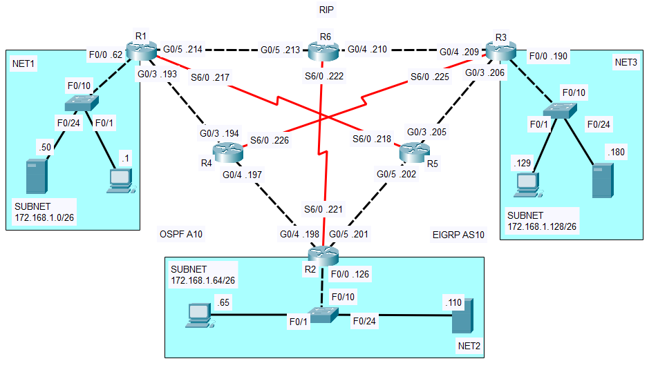

# Lab 01 - Restricted Dynamic Network

In this lab you will mainly configure three common Internal Gateway Protocols: Open-Shortest Path First (OSPF), Enhanced Interior Gateway Protocol (EIGRP), and Routing Information Protocol (RIP). Additionally, you will need to set up some security measures in the internal networks to permit or deny certain traffic by configuring standard and extended Access Control Lists (ACL) and Virtual Local Area Networks (VLANs).
This lab will help you practice more about dynamic routing protocols and basic security measures on Cisco Routers using ACLs, ensuring that you get a solid understanding of how IGPs operate and how ACLs affect the flow of traffic in an organizational network.

## Relevant CCNA Exam Topics

This lab convers the following requirements in the CCNA Exam Topics List:i

- **Network Access**
    - Configure and verify VLANs.
    - Configure and verify interswitch connectivity.
- **IP Connectivity**
    - Configure and verify single area OSPFv2.
- **Security Fundamentals**
    - Configure and verify access control lists.

### Router-specific Commands

| **Command** 	| **Config Mode** 	| **Description** 	|
|---	|---	|---	|
| `router ospf {pid}` 	| Global Configuration 	| Enabled OSPF routing process with the specified process ID. 	|
| `passive-interface {if-id}` 	| OSPF Router Configuration 	| Set the specified interface as a passive OSPF interface (no OSPF updates sent). 	|
| `auto-cost reference-bandwidth {bandwidth}` 	| OSPF Router Configuration 	| Adjusted the OSPF cost reference bandwidth for better metric calculation. 	|
| `network {network-ip} {wildmask} area {area}` 	| OSPF Router Configuration 	| Configured OSPF network statement for the specified area. 	|
| `router eigrp {as_num}` 	| Global Configuration 	| Entered EIGRP routing configuration mode with the specified autonomous system (AS) number. 	|
| `network {network-ip} [wildmask]` 	| EIGRP Router Configuration 	| Configured the EIGRP network for the specified IP range. 	|
| `router rip` 	| Global Configuration 	| Entered RIP routing configuration mode. 	|
| `version {version}` 	| RIP Router Configuration 	| Set RIP to the specified version for classless routing. 	|
| `network {network-ip}` 	| RIP Router Configuration 	| Configured the RIP network to include the specified network. 	|
| `no auto-summary` 	| RIP/EIGRP Router Configuration 	| Disabled automatic summarization for RIP/EIGRP. 	|
| `ip access-group {name} {in\|out}` 	| Interface Configuration 	| Applied an access list to filter traffic in the specified direction on the interface. 	|
| `ip access-list extended {acl-name\|acl-num}` 	| Global Configuration 	| Created an extended ACL with the specified name. 	|
| `{permit\|deny} {protocol} {src-ip} {wildmask} {dst-ip} {wildmask}` 	| Access List Configuration 	| Permitted/Deny traffic based on specified source/destination. 	|
| `ip access-list standard {acl-num}` 	| Global Configuration 	| Created a standard ACL with the specified name. 	|
| `{permit\|deny} [host] {ip-address}` 	| Access List Configuration 	| Permitted/Deny traffic from the specified host. 	|
| `encapsulation dot1Q {vid}` 	| Subinterface Configuration 	| Configured IEEE 802.1Q encapsulation with a specified VLAN on a subinterface. 	|

### Switch-specific Commands

| **Command** 	| **Config Mode** 	| **Description** 	|
|---	|---	|---	|
| `switchport access vlan {vlan-id}` 	| Interface Configuration 	| Assigns the interface to the specified VLAN in access mode. 	|
| `switchport mode access` 	| Interface Configuration 	| Configures the interface to operate in access mode (for a single VLAN). 	|
| `switchport trunk native vlan {vlan-id}` 	| Interface Configuration 	| Specifies the native VLAN for untagged traffic on a trunk interface. 	|
| `switchport trunk allowed vlan {vlan-id-list}` 	| Interface Configuration 	| Specifies the allowed VLANs on a trunk interface. 	|
| `switchport mode trunk` 	| Interface Configuration 	| Configures the interface to operate in trunk mode. 	|
| `encapsulation dot1Q {vid}` 	| Subinterface Configuration 	| Configured IEEE 802.1Q encapsulation with a specified VLAN on a subinterface. 	|

## Verify your solution

Use the following checklist to verify your solution:

1. (TODO)

**The checklist only verifies some parts of the lab and is not exhaustive.*

## Known errors and bugs

No known errors/bugs yet.
